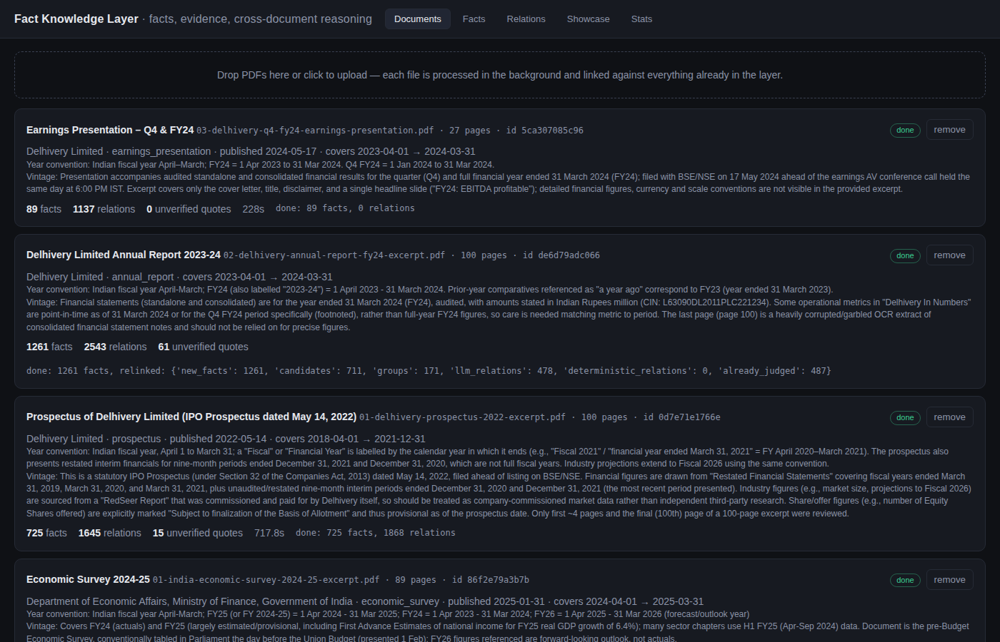
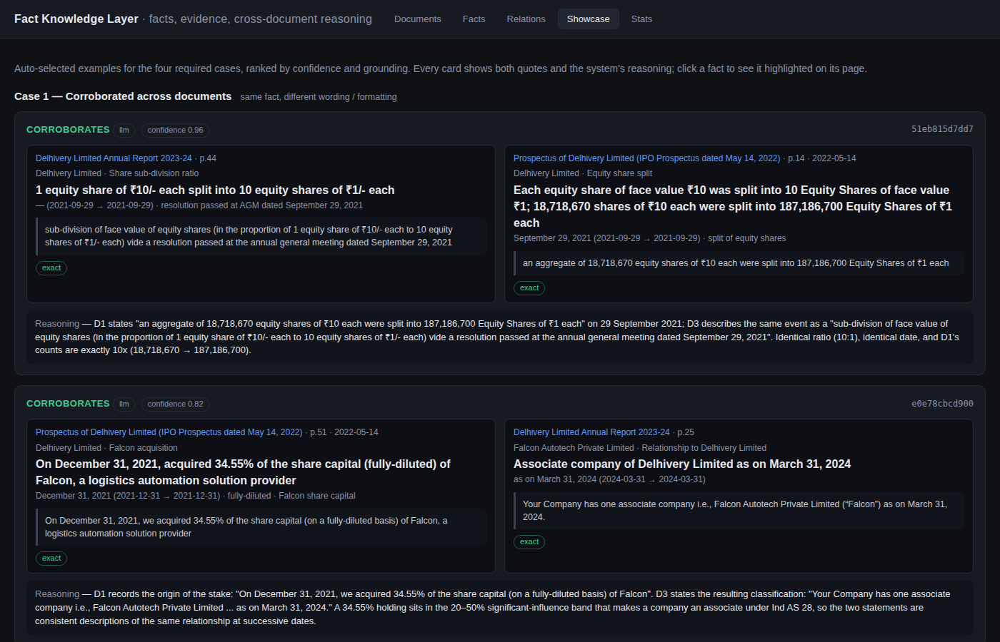
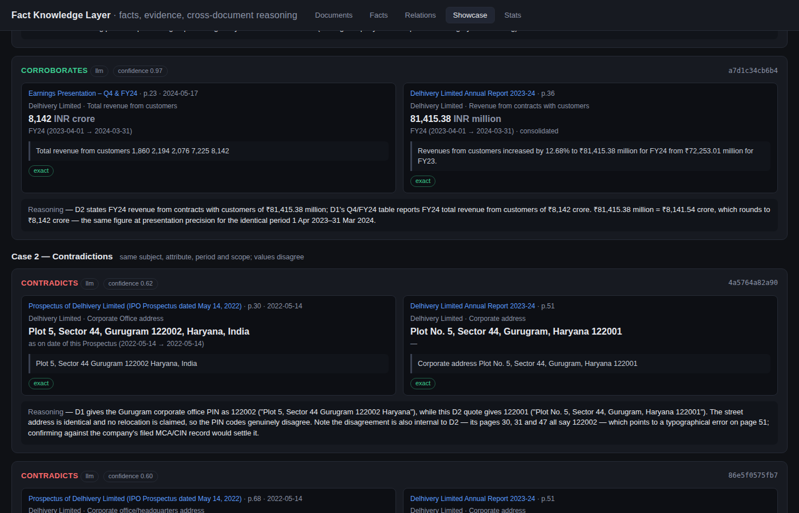
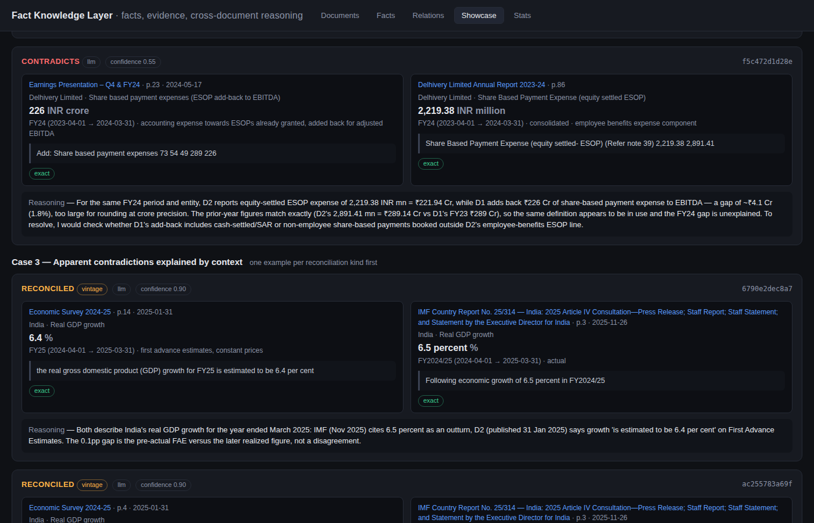
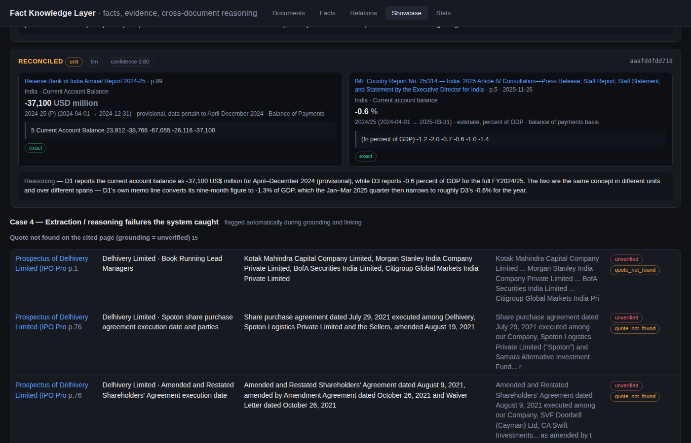

# Fact Knowledge Layer

Upload PDFs → get **facts**, each pinned to a **verbatim quote on a page**, and **cross-document relations** that say
whether two facts *corroborate*, *contradict*, or only *appear* to contradict until you look at the period, scope,
unit or data vintage — with the reasoning written out so a reader can check it against the two quotes.

Built for the Superjoin VIT 2026 engineering-intern assignment. Runs locally: Python, SQLite, a small vanilla-JS UI,
and an LLM behind a one-function interface.

> **Video demo:** _link goes here_ (≤ 3 min: a PDF being processed, then the four required cases)

---

## Setup and run

Requirements: Python 3.12+, [`uv`](https://docs.astral.sh/uv/), and an LLM backend (see below).

```bash
git clone https://github.com/Cassian433/fact-knowledge-layer.git && cd fact-knowledge-layer
uv sync                                   # installs everything into .venv (PyMuPDF, FastAPI, fastembed, anthropic ...)

# choose ONE backend (see "LLM backend" below)
export FACTLAYER_LLM_BACKEND=anthropic    # official Anthropic SDK - needs ANTHROPIC_API_KEY (or `ant auth login`)
#   or
export FACTLAYER_LLM_BACKEND=claude_cli   # shells out to a logged-in Claude Code CLI (`claude -p`) - no key in the repo

uv run python -m factlayer.cli serve --port 8801      # UI + API at http://127.0.0.1:8801
```

Then drop PDFs onto the **Documents** tab. Each document is processed in the background (progress is live) and
linked against everything already in the layer. Or use the CLI:

```bash
uv run python -m factlayer.cli ingest path/to/a.pdf path/to/b.pdf   # processes in order, prints counts
uv run python -m factlayer.cli stats                                 # facts / relations / model calls + spend
uv run python -m factlayer.cli reground                              # re-run quote verification (no model calls)
```

The first run downloads a ~130 MB sentence-embedding model (`BAAI/bge-small-en-v1.5`, runs on CPU) into `data/models/`.
Everything the system knows lives in one SQLite file, `data/factlayer.db`; delete it to start over.

### LLM backend

| `FACTLAYER_LLM_BACKEND` | what it does | when to use |
|---|---|---|
| `anthropic` | `anthropic` SDK, structured outputs (`output_config.format = json_schema`), streaming, prompt caching on the system prompt | you have an API key — the normal way to run this |
| `claude_cli` (default) | one `claude -p --json-schema … --tools ""` subprocess per call, using whatever login the Claude Code CLI has | what I used for the demo; nothing to configure if Claude Code is installed and logged in |

Both backends implement the same `complete_json(system, user, schema) -> dict` contract, so nothing else in the code
knows which one is running. Two model tiers are used: `FACTLAYER_MODEL_FAST` for bulk extraction (default Sonnet) and
`FACTLAYER_MODEL_SMART` for cross-document judgement (default Opus). Every call is logged to the `llm_calls` table with
latency and reported cost — visible on the **Stats** tab.

Other knobs (all optional, via env or `.env`): `FACTLAYER_LLM_CONCURRENCY` (default 8; the run below used 12),
`FACTLAYER_CHUNK_CHARS` (18 000), `FACTLAYER_MAX_FACTS_PER_CHUNK` (40), `FACTLAYER_SIM_THRESHOLD` (0.86),
`FACTLAYER_MAX_NEIGHBOURS` (5), `FACTLAYER_NUMERIC_TOLERANCE` (0.01).

### API

| method | path | purpose |
|---|---|---|
| `POST` | `/api/documents` (multipart `files`) | upload one or more PDFs; returns doc ids, processing starts immediately |
| `GET` | `/api/documents`, `/api/documents/{id}` | status, progress, LLM-derived document metadata, counts |
| `GET` | `/api/documents/{id}/pages/{n}`, `/api/documents/{id}/pdf` | raw page text (what quotes are verified against) / the PDF |
| `DELETE` | `/api/documents/{id}` | remove a document with its facts and relations |
| `GET` | `/api/facts?q=&doc_id=&kind=&grounding=&flagged=` | search facts |
| `GET` | `/api/facts/{id}` | one fact + page text + quote offsets + its relations |
| `GET` | `/api/relations?type=&reconciliation=&doc_id=&method=&q=` | corroborates / contradicts / reconciled / unrelated |
| `GET` | `/api/showcase` | auto-picked examples of the four required cases + every failure the system caught |
| `GET` | `/api/stats` | counts, grounding quality, model calls and spend |

---

## Approach

### The shape of a fact

The documents decide what a fact is; the schema only fixes *how* one is written down:

```
subject      "Delhivery Limited" / "India" / a person / a segment
attribute    "Revenue from operations", "Headline CPI inflation", "Registered office address", "Board position"
value        value_text as written  +  value_num, unit, scale  →  value_norm (scale applied, e.g. crore → ×1e7)
period       label as written ("FY24", "Q4 FY24", "2024-25", "as at 31 March 2024") + ISO start/end + type
basis/scope  consolidated | standalone | provisional | advance estimate | projection | segment | constant prices …
evidence     verbatim quote, page number, character offsets on that page, grounding tier, verification flags
```

`basis`/`scope`/`period` are first-class because they are exactly the things that turn an apparent contradiction into
a reconcilable difference. A "revenue" number without its period and basis is not comparable to anything.

### Pipeline (per document)

```
PDF ──PyMuPDF──▶ page texts ──▶ page-anchored chunks (~18k chars, "[[page N]]" markers)
      │
      ├─▶ 1. document metadata (1 LLM call on first pages + last page)
      │       publisher, type, publication date, period covered, FISCAL-YEAR CONVENTION, currency/scale, vintage notes
      │
      ├─▶ 2. fact extraction (1 LLM call per chunk, concurrent, structured output against FACT_SCHEMA)
      │       the document metadata is in the prompt, so "FY24" resolves to 2023-04-01..2024-03-31 for this document
      │
      ├─▶ 3. grounding (no LLM) — every quote is searched for on the cited page (and neighbours):
      │       exact → whitespace/case-insensitive → fuzzy alignment (≥85) → token window → unverified
      │       + checks: the number in the fact must appear in the quote; wrong page numbers are corrected and flagged
      │
      ├─▶ 4. normalisation (no LLM) — units (Rs/₹/INR → INR), scales, attribute slug, fallback period parser
      │
      ├─▶ 5. embeddings (local) of "subject | attribute" for candidate matching
      │
      └─▶ 6. linking against every fact already in the layer (incremental — earlier documents are not reprocessed)
              a. candidates: same attribute slug OR cosine ≥ 0.86, same kind, other documents only, ≤ 5 per fact
              b. deterministic judge: identical unit + period + basis + scope → arithmetic decides "corroborates"
              c. LLM judge (smart tier): groups of candidates with both documents' metadata → corroborates /
                 contradicts / reconciled(kind) / unrelated, with 2–4 sentences of reasoning per pair
```

### Decisions and trade-offs

**Grounding is verified, not trusted.** The model is asked for a verbatim quote, and then the quote is *found* in the
stored page text. Only facts whose evidence was located are shown as grounded; the UI highlights the located span on
the page. This caught the most common failure in the dataset (see Case 4): slide decks lay KPI tiles side by side, so
the text extractor emits all the numbers on one line and all the labels on the next — the model's quote is "right" but
not contiguous. A token-window tier handles that honestly (all numbers present, ≥80 % of tokens inside one ≤800-char
window → grounding = `window`, flagged `quote_not_contiguous`) instead of either rejecting good facts or pretending
the quote was exact.

**Two-stage linking, cheap recall then expensive precision.** Embedding similarity on `subject | attribute` plus an
exact slug match finds candidates for pennies; only candidate groups go to the model. A deterministic judge settles
the easy numeric cases (same period/basis/unit, values within 1 %) with a reasoning string that shows the arithmetic;
its verdicts are stored as `method = deterministic` so you can see which relations never needed a model. The model
judge sees the *documents'* metadata (publication date, period covered, fiscal-year convention, vintage notes) next to
the facts — that context is what lets it say "provisional estimate in a May 2025 report vs. the figure the IMF used in
November 2025" rather than "contradiction".

**Structured outputs everywhere.** Every model call is constrained by a JSON schema (`--json-schema` on the CLI,
`output_config.format` on the API). There is no JSON repair code because there are no JSON failures; the interesting
failures are semantic, and those are what the grounding checks and the `unrelated` verdicts surface.

**Per-document fiscal conventions instead of a global one.** The metadata step asks each document how it labels
years. The Delhivery filings and the Indian institutional reports use April–March; the IMF report mixes fiscal years
written as "FY2024/25" with calendar-year tables. Resolving labels to ISO ranges per document is what makes period
comparison across publishers possible at all; a rule-based parser (`normalize.parse_period`) fills in when the model
leaves the dates blank, and marks the fact `period_parsed_by_rule`.

**SQLite + one process.** Facts, pages, relations, embeddings and the model-call log are five tables in one file. It is
trivially inspectable (`sqlite3 data/factlayer.db`), incremental by construction (a new document only links against
what exists), and more than enough for tens of thousands of facts. A graph database would add a dependency without
adding a capability at this size; the relations table *is* the graph.

**What I deliberately did not do:** OCR (scanned pages are detected and flagged, not guessed at), table-structure
recovery (the model reads tables as text, which works for totals and headline rows but not for dense statements —
see Limitations), and any document-specific rule. Nothing in the code knows about revenue, inflation, Delhivery or
the RBI; the prompts describe *kinds* of facts (headline figures, roles, dates, addresses) and let the document supply
the rest.

### AI tools used

- **Claude** (Sonnet for extraction, Opus for judgement) is the runtime model, called through the Claude Code CLI in
  print mode during development and demo; the Anthropic SDK backend is the intended production path.
- **Claude Code** wrote most of this code with me driving: architecture, prompts, the grounding tiers and the UI were
  iterated on live against the starter documents. The commits are honest about that.
- `fastembed` (`BAAI/bge-small-en-v1.5`, ONNX on CPU) for candidate matching — no embedding API needed.

---

## Results on the starter dataset

_Filled in from the actual run — see the Showcase tab for the live version._

Six starter PDFs (Delhivery prospectus 2022, annual report FY24, Q4 FY24 deck; Economic Survey 2024-25, RBI Annual
Report 2024-25, IMF 2025 Article IV — 511 pages) processed with the `claude_cli` backend, Sonnet for extraction and Opus
for judgement, concurrency 12.

| | |
|---|---|
| facts | **3,702** (2,680 numeric, 1,022 statements) |
| evidence grounding | **3,194 exact** (86 %) · 230 fuzzy · 185 token-window · **93 unverified (2.5 %)** |
| verification flags | 42 page numbers corrected · 61 numbers not found in their own quote · 67 low model confidence |
| relations (cross-document) | **281 corroborate** (3 by arithmetic) · **4 contradict** · **2,009 reconciled** · 1,793 candidate pairs rejected as *unrelated* |
| reconciliation kinds | period 1,477 · scope 270 · definition 179 · vintage 55 · unit 17 · estimate-vs-actual 8 · rounding 2 |
| model calls | 108 extraction (avg 90 s) · 146 judgement (avg 97 s) · 7 metadata — all succeeded |
| wall time per document | deck 4 min · Economic Survey 4 min · RBI 9.5 min · IMF 11 min · prospectus 12 min · annual report ~20 min |



**Unseen document test.** After the six starter PDFs, I uploaded Delhivery's 3-page Q4 FY25 results press release
(May 2025, [public](https://www.delhivery.com/uploads/2025/05/PressRelease_Q4FY25.pdf), not in the starter set). In 3.5
minutes it produced 40 facts (all grounded) and 153 relations: its FY24 comparatives — *"Rs. 8,142 Cr in FY24"*,
*"a loss of Rs. 249 Cr in FY24"*, *"Rs. 2,076 Cr in Q4 FY24"* — corroborated the annual report and the deck (three of
them by arithmetic alone), its FY25 figures were reconciled to the FY24 ones by period, and 25 loose candidates were
rejected. This is the document used for the live-upload part of the video.

Grounding was 12.7 % unverified after the first full run. Inspecting the failures showed the quotes were right and the
*page text* was wrong: PyMuPDF's geometric sort interleaves the two columns of a typeset report line by line. Switching
to the PDF's native content order and re-running verification (`reground --reextract`, no model calls) took it to 2.5 %.
That loop — extract, verify, look at what failed, fix the deterministic part — is the workflow this system is built for.


## The four cases

Everything below is taken from the **Showcase** tab (`/api/showcase`), which ranks the relations table; nothing is
hand-picked in code. Fact ids are clickable in the UI to see the quote highlighted on its page.

### Case 1 — corroborated across documents, expressed differently



- **Same number, different unit and scale.** Annual report p.36: *"Revenues from customers increased by 12.68% to
  ₹81,415.38 million for FY24"* ↔ Q4 FY24 deck p.23: *"Total revenue from customers 1,860 2,194 2,076 7,225 8,142"*
  (₹ crore). Judge: *"₹81,415.38 million = ₹8,141.54 crore, which rounds to ₹8,142 crore — the same figure at
  presentation precision for the identical period 1 Apr 2023–31 Mar 2024."* → **corroborates**, 0.97.
- **Same event, different description.** Prospectus p.14: *"18,718,670 equity shares of ₹10 each were split into
  187,186,700 Equity Shares of ₹1 each"* ↔ annual report p.44: *"sub-division … 1 equity share of ₹10/- each to 10 equity
  shares of ₹1/- each vide a resolution passed at the annual general meeting dated September 29, 2021"*. Judge: identical
  10:1 ratio, identical date, counts exactly 10×. → 0.96.
- **Same place, different spelling.** Registered office *"…Indira Gandhi International Airport, New Delhi 110037"*
  (prospectus) ↔ *"…IGI Airport, New Delhi 110037"* (annual report). → 0.97.
- **Settled without a model.** IMF p.3 *"6.5 percent"* real GDP growth FY2024/25 ↔ RBI p.22 *"6.5 per cent"* 2024-25:
  same attribute slug, same ISO period, same unit → `method = deterministic`. Same for foreign-exchange reserves
  US$ 668 bn ↔ US$ 668.3 bn at end-March 2025 (0.04 % apart).

### Case 2 — a genuine (or likely) contradiction



- **PIN code of the corporate office.** Prospectus p.30 and p.68: *"Plot 5, Sector 44, Gurugram- 122002, Haryana"*
  ↔ annual report p.51 (BRSR section): *"Corporate address Plot No. 5, Sector 44, Gurugram, Haryana 122001"*.
  Judge: *"The street address is identical and no relocation is claimed, so the PIN codes genuinely disagree. Note the
  disagreement is also internal to D2 — its pages 30, 31 and 47 all say 122002 — which points to a typographical error on
  page 51; confirming against the company's filed MCA/CIN record would settle it."* → **contradicts**, 0.62. This is a
  real inconsistency inside a filed document, found by comparing two documents.
- **Share-based payment expense, FY24.** Deck p.23 adds back *"Share based payment expenses … 226"* (₹ crore) to EBITDA ↔
  annual report p.86 *"Share Based Payment Expense (equity settled- ESOP) … 2,219.38"* (₹ million = ₹221.94 crore).
  Judge: 1.8 % gap is too large for rounding at crore precision, the FY23 figures match exactly (289), *"so the same
  definition appears to be in use and the FY24 gap is unexplained. To resolve, I would check whether D1's add-back
  includes cash-settled/SAR or non-employee share-based payments booked outside D2's employee-benefits ESOP line."*
  → **contradicts**, 0.55 — a *likely* contradiction with an explicit hypothesis for how it might reconcile.

Only four contradictions survived out of ~4,100 judged pairs; the judge is deliberately conservative and prefers
"reconciled" with a stated reason when the documents supply one.

### Case 3 — an apparent contradiction explained by context



- **Vintage.** Economic Survey (31 Jan 2025) p.14: real GDP growth FY25 *"estimated to be 6.4 per cent"* (First
  Advance Estimates) ↔ IMF (Nov 2025) p.3: *"6.5 percent"*. Judge: *"The 0.1pp gap is the pre-actual FAE versus the
  later realized figure, not a disagreement."* → **reconciled / vintage**, 0.90.
- **Definition.** RBI p.18: gross fiscal deficit target *"4.4 per cent of GDP in 2025-26 (BE)"* ↔ IMF p.15: *"4.5
  percent of GDP"*. Judge: *"D3's own parenthetical resolves the gap: '4.4 percent of GDP (4.5 percent of GDP, IMF
  definition)'."* → **reconciled / definition**, 0.93.
- **Scope.** Annual report p.85: Express Parcel revenue *"50,765.87"* ₹ mn ↔ deck p.6: *"₹8,142 Cr FY24 revenue from
  services"*. Judge: segment vs total for the same period; the segment lines sum toward the 81,415.38 mn total.
  → **reconciled / scope**, 0.93.
- **Unit.** RBI: current account deficit *"US$ 37.1 billion"* (Apr–Dec 2024) ↔ IMF: *"0.2 percent of GDP"* (2025Q2).
  → **reconciled / unit** (and period), 0.82.
- **Period.** Deck: *"₹2,076 Cr Q4 FY24 revenue from services"* ↔ annual report: *"₹81,415Mn"* FY24 — *"the quarter is
  a component of the year — D1's own table shows 1,860/2,194/2,076 quarters against the 8,142 annual total"*.
  → **reconciled / period**, 0.92. Period is by far the most common reconciliation (1,477 of 2,009): three Delhivery
  filings four fiscal years apart, and macro reports mixing fiscal, calendar and quarterly windows.
- **Estimate vs actual.** Global growth 2024: *"3.2 per cent"* (Economic Survey citing the IMF projection) ↔
  *"3.3 per cent"* (RBI citing WEO April 2025 outturn). → 0.85.

### Case 4 — extraction and reasoning failures, and what was done about them



1. **Two-column interleaving (fixed).** The biggest failure by count: 469 correct quotes could not be found because
   the extractor's geometric sort merged the two columns of the RBI and Delhivery annual reports line by line —
   e.g. p.70 of the RBI report reads *"…grants-in-aid to states II.6.4 Capital expenditure undershot the BE by / declined
   to 1.6 per cent of GDP from 1.8 per cent ₹92,682 crore and was placed at 3.1 per cent…"*. Diagnosed from the
   Showcase failure list, fixed by using the PDF's native content order, verified by re-grounding: 469 → 93 unverified.
2. **Slide tiles (handled).** KPI tiles on the earnings deck put all values on one line and all labels on the next, so a
   quote like *"₹8,142 Cr / FY24 revenue from services"* is right but not contiguous. A token-window tier accepts it
   (all numbers present, ≥ 80 % of tokens within 800 chars), labels it `window`, and flags `quote_not_contiguous`
   instead of either dropping a good fact or pretending the quote was exact. 185 facts are grounded this way.
3. **Condensed list quotes (flagged, not fixed).** For list-like facts the model sometimes joins the items — *"Kotak
   Mahindra Capital Company Limited, Morgan Stanley India Company Private Limited, BofA Securities India Limited,
   Citigroup…"* — into one "quote" that never appears verbatim because other text sits between the names. These are the
   bulk of the remaining 93 unverified facts. Next step: allow several short verbatim spans per fact instead of one.
4. **Numbers read off a chart (caught by the judge).** From the deck's receivable-days chart the extractor produced a
   fact from the number row *"106 87 77 74 66"*; comparing it with the annual report's *"from 77 days a year ago"*, the
   judge worked out that the alignment puts 74 at March 2023 and 77 at March 2022, called it a contradiction at
   confidence 0.50 and said it would *"check the actual axis labels/legend of the D1 slide 16 chart, since the value is
   read from an OCR'd number row"*. Low confidence plus an explicit verification step is the right output here.
5. **Wrong page numbers (corrected).** 42 facts cited a neighbouring page; grounding located the quote on the right
   page and flagged `page_corrected:8->7`.
6. **Pre-scaled numbers (flagged).** 61 numeric facts have a `value_num` that does not appear in their own quote —
   typically the model multiplied *"₹2.0 lakh crore"* into `200000` while also setting `scale`, or wrote *"five"*.
   They are shown with a `value_not_in_quote` flag and excluded from the arithmetic judge.
7. **False candidates (the cost of recall).** 1,793 of the ~4,100 pairs sent to the judge came back *unrelated* —
   *"Only the word 'freight' is shared"* — because candidate generation is deliberately loose (cosine ≥ 0.86 on short
   strings). They cost model time, not correctness; they are listed on the Showcase tab.
8. **The arithmetic judge rarely fires (3 of 284 corroborations).** Publishers word the same attribute differently
   ("Revenue from services" vs "Revenue from contracts with customers"), so the exact-slug precondition seldom holds.
   Canonical attribute names (see Next steps) would move many pairs from the model to arithmetic.


---

## Limitations and next steps

**What does not work well yet**

- **Dense financial statements.** A 100-page annual-report excerpt yields ~1 200 facts, but from a note like "Trade
  receivables" the model reads a few numbers, not the whole table, and column headers (FY24 vs FY23) are sometimes
  mis-assigned when the text extractor interleaves columns. Table-structure recovery (PyMuPDF `find_tables` or a layout
  model) feeding a table-aware prompt is the obvious next step.
- **Candidate recall is bounded by embeddings on `subject | attribute`.** "Revenue from services" and "Revenue from
  operations" match (0.93); "Gross fiscal deficit" and "Fiscal balance" do — but a fact described as "net loss" in one
  document and "loss for the year" in another can sit below the 0.86 threshold (I raised it from 0.82 mid-run because
  57 % of judged pairs were coming back *unrelated*). Lowering the threshold trades model calls for recall; a better fix
  is a canonical attribute name per fact.
- **Judgement is per group, not global.** Each group is a new fact plus ≤ 9 candidates. Chains ("A corroborates B,
  B contradicts C") are visible in the UI but never reasoned about together; the next step is clustering into
  per-attribute timelines (all values of "Revenue from operations" across periods and documents) and judging the
  timeline as one object, which also gives an obvious place for revision tracking.
- **Statements are compared more loosely than numbers.** Non-numeric facts (roles, addresses) have no deterministic
  judge and depend entirely on the model; the false-match filter ("unrelated") works but adds model calls.
- **Throughput.** With the CLI backend each extraction call is a subprocess and ~90 s for an 18k-char chunk, each
  judgement batch ~100 s; a 100-page report takes 10–20 minutes at concurrency 12. The SDK backend with prompt caching
  and the Batch API would be several times cheaper and faster for bulk ingestion.
- **No OCR, no images.** Charts on slides are invisible to the system; scanned pages are flagged, not read.

**Next**

1. Attribute canonicalisation: a small "attribute registry" that grows as new kinds of facts appear (the brownie-point
   evolving schema), with the model mapping each new attribute to an existing canonical one or minting a new one.
2. Timeline objects per (subject, canonical attribute): every value with its period and vintage, so revisions
   (advance → provisional → revised estimates) become a first-class story instead of many pairwise relations.
3. Table-aware extraction for financial statements and statistical annexes.
4. Human feedback on relations (confirm / reject) stored back into the DB and used as few-shot examples for the judge.
5. Batch API + caching for the Anthropic backend; re-use the document metadata + system prompt as a cached prefix.

## Additional notes

- Nothing document-specific is hard-coded: filenames, schemas and rules are the same for the Delhivery filings, the
  macro reports, and whatever you upload next. The Showcase tab is a ranking over the relations table, not a curated
  list.
- Credentials never enter the repo: the `claude_cli` backend uses the CLI's own login; the `anthropic` backend reads
  the standard environment/profile.
- Costs shown on the Stats tab are the values *reported by the CLI* for each call; with the subscription-backed CLI
  they are notional, and they include the CLI's own system prompt tokens.
